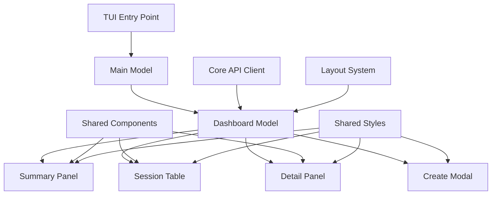
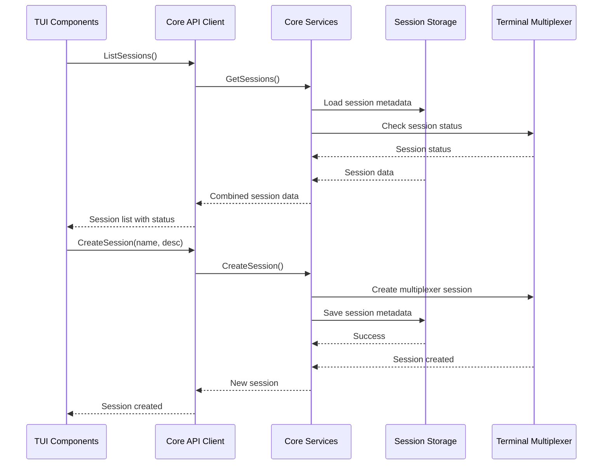

# Design Document

## Overview

The TUI Implementation will provide a comprehensive Terminal User Interface for Claude Pilot using the Bubble Tea framework. The design leverages the existing monorepo architecture, shared components, and theming system to create a cohesive experience that complements the CLI interface. The TUI will feature a responsive dashboard layout with real-time session monitoring, interactive session management, and keyboard-driven navigation.

## Architecture

### High-Level Architecture



### Component Hierarchy

The TUI follows a hierarchical component structure based on Bubble Tea's Model-View-Update pattern:

1. **MainModel** - Root application model that handles global state and window sizing
2. **DashboardModel** - Primary interface containing all dashboard components
3. **Component Models** - Individual interactive components (panels, tables, modals)
4. **Shared Components** - Reusable UI elements from the shared package

### Package Structure Integration

The TUI implementation integrates with the existing monorepo structure:

- **`packages/tui/main.go`** - Entry point, initializes core API client
- **`packages/tui/internal/ui/main.go`** - Main TUI model and global state management
- **`packages/tui/internal/models/`** - Individual component models
- **`packages/shared/`** - Shared components, styles, and layout utilities
- **`packages/core/`** - Business logic and API client

## Components and Interfaces

### 1. Main Model (`ui/main.go`)

**Purpose**: Root model that manages global application state and coordinates between components.

**Responsibilities**:
- Initialize core API client
- Handle window resize events
- Coordinate between dashboard components
- Manage application lifecycle

**Interface**:
```go
type MainModel struct {
    client    *api.Client
    dashboard *models.DashboardModel
    width     int
    height    int
}

func (m *MainModel) Init() tea.Cmd
func (m *MainModel) Update(msg tea.Msg) (tea.Model, tea.Cmd)
func (m *MainModel) View() string
```

### 2. Dashboard Model (`models/dashboard.go`)

**Purpose**: Primary interface that orchestrates all dashboard components and handles navigation.

**Responsibilities**:
- Manage component focus and navigation
- Handle keyboard shortcuts and global actions
- Coordinate data flow between components
- Manage modal overlays
- Implement responsive layout logic

**Key Features**:
- Component focus management (Tab cycling)
- Modal overlay system for session creation
- Responsive layout adaptation
- Real-time session data updates
- Keyboard shortcut handling

**Interface**:
```go
type DashboardModel struct {
    client          *api.Client
    width, height   int
    summaryPanel    *SummaryPanelModel
    sessionTable    *SessionTableModel
    detailPanel     *DetailPanelModel
    createModal     *CreateModalModel
    focused         Component
    showCreateModal bool
    sessions        []*api.Session
    selectedSession *api.Session
}
```

### 3. Session Table Model (`models/session_table.go`)

**Purpose**: Interactive table for displaying and navigating sessions.

**Responsibilities**:
- Display sessions in a formatted table
- Handle keyboard navigation (arrow keys, page up/down)
- Manage selection state
- Implement viewport scrolling for large session lists
- Provide real-time status updates

**Key Features**:
- Keyboard navigation (↑/↓, Page Up/Down, Home/End)
- Visual selection indicators
- Viewport scrolling with scroll indicators
- Status-based color coding
- Responsive column sizing

**Interface**:
```go
type SessionTableModel struct {
    client        *api.Client
    width, height int
    table         *components.Table
    sessions      []*api.Session
    selectedIndex int
    viewportStart int
    viewportSize  int
}
```

### 4. Summary Panel Model (`models/summary_panel.go`)

**Purpose**: Display high-level session statistics and system information.

**Responsibilities**:
- Show session count by status (active, inactive, error)
- Display backend information (tmux/zellij)
- Provide quick system health overview
- Update statistics in real-time

**Key Features**:
- Card-based layout for statistics
- Color-coded status indicators
- Backend status display
- Responsive sizing

**Interface**:
```go
type SummaryPanelModel struct {
    client    *api.Client
    width     int
    sessions  []*api.Session
    stats     SessionStats
}

type SessionStats struct {
    Total    int
    Active   int
    Inactive int
    Error    int
    Backend  string
}
```

### 5. Detail Panel Model (`models/detail_panel.go`)

**Purpose**: Display detailed information about the selected session.

**Responsibilities**:
- Show comprehensive session metadata
- Display session history and messages
- Provide scrollable content for long descriptions
- Handle session-specific actions

**Key Features**:
- Scrollable content area
- Formatted metadata display
- Message history (if available)
- Action buttons for session management

**Interface**:
```go
type DetailPanelModel struct {
    client    *api.Client
    width, height int
    session   *api.Session
    scrollY   int
    content   string
}
```

### 6. Create Modal Model (`models/create_modal.go`)

**Purpose**: Modal dialog for creating new sessions.

**Responsibilities**:
- Provide form inputs for session creation
- Validate input data
- Handle form submission
- Manage modal state (open/closed/completed)

**Key Features**:
- Text input fields with validation
- Form navigation (Tab between fields)
- Input validation and error display
- Keyboard shortcuts (Enter to submit, Escape to cancel)

**Interface**:
```go
type CreateModalModel struct {
    client      *api.Client
    width, height int
    nameInput   textinput.Model
    descInput   textinput.Model
    focused     int
    completed   bool
    error       error
}
```

## Data Models

### Session Data Flow



### Message Types

The TUI uses custom message types for component communication:

```go
// Global messages
type SessionsLoadedMsg struct {
    Sessions []*api.Session
    Error    error
}

type SessionSelectedMsg struct {
    Session *api.Session
}

type SessionCreatedMsg struct {
    Session *api.Session
    Error   error
}

type SessionAttachedMsg struct {
    SessionID string
    Error     error
}

type SessionKilledMsg struct {
    SessionID string
    Error     error
}

// Component-specific messages
type RefreshDataMsg struct{}
type ShowModalMsg struct{ Type string }
type HideModalMsg struct{}
```

## Error Handling

### Error Display Strategy

1. **Inline Errors**: Display errors within the relevant component
2. **Modal Errors**: Show critical errors in modal dialogs
3. **Status Bar Errors**: Display transient errors in the footer
4. **Graceful Degradation**: Continue operation when non-critical errors occur

### Error Types and Handling

```go
type ErrorSeverity int

const (
    ErrorInfo ErrorSeverity = iota
    ErrorWarning
    ErrorCritical
)

type TUIError struct {
    Message   string
    Severity  ErrorSeverity
    Component string
    Timestamp time.Time
}
```

**Error Handling Patterns**:
- **Connection Errors**: Show in status bar, retry automatically
- **Session Errors**: Display inline in session table with error status
- **Input Validation**: Show inline in forms with field highlighting
- **System Errors**: Display in modal with option to retry or exit

## Testing Strategy

### Unit Testing

**Component Testing**:
- Test each model's Update and View methods
- Mock API client for isolated testing
- Test keyboard navigation and state transitions
- Verify responsive layout behavior

**Integration Testing**:
- Test component interaction and message passing
- Verify data flow between components
- Test error handling and recovery
- Validate theming consistency

### Test Structure

```go
// Example test structure
func TestDashboardModel_Navigation(t *testing.T) {
    client := &mockapi.Client{}
    model := models.NewDashboardModel(client)
    
    // Test Tab navigation
    model, cmd := model.Update(tea.KeyMsg{Type: tea.KeyTab})
    assert.Equal(t, models.ComponentTable, model.focused)
    
    // Test session selection
    model, cmd = model.Update(tea.KeyMsg{Type: tea.KeyEnter})
    assert.NotNil(t, cmd)
}
```

### Manual Testing Scenarios

1. **Responsive Behavior**: Test on different terminal sizes (80x24, 120x40, 160x50)
2. **Keyboard Navigation**: Verify all shortcuts work correctly
3. **Real-time Updates**: Test session status changes and automatic refresh
4. **Error Scenarios**: Test network failures, invalid inputs, missing dependencies
5. **Performance**: Test with large numbers of sessions (50+, 100+)

## Implementation Details

### Responsive Layout Implementation

The TUI implements responsive behavior using the shared layout system:

```go
func (m *DashboardModel) renderMainContent() string {
    layoutWidth, size := styles.GetResponsiveWidth(m.width)
    
    switch size {
    case "small":
        // Stack vertically, show only active component
        return m.renderSinglePanel()
    case "medium":
        // Two-column layout: table + details
        return m.renderTwoColumnLayout(layoutWidth)
    default: // large
        // Full layout with all panels visible
        return m.renderFullLayout(layoutWidth)
    }
}
```

### Keyboard Shortcut System

Centralized keyboard handling with context-aware shortcuts:

```go
type KeyHandler struct {
    context string
    bindings map[string]func() tea.Cmd
}

var globalKeys = KeyHandler{
    context: "global",
    bindings: map[string]func() tea.Cmd{
        "ctrl+c": func() tea.Cmd { return tea.Quit },
        "q":      func() tea.Cmd { return tea.Quit },
        "r":      func() tea.Cmd { return refreshData() },
        "c":      func() tea.Cmd { return showCreateModal() },
        "tab":    func() tea.Cmd { return cycleFocus() },
    },
}
```

### Real-time Updates

Implement periodic refresh and event-driven updates:

```go
func (m *DashboardModel) startPeriodicRefresh() tea.Cmd {
    return tea.Tick(time.Second*5, func(t time.Time) tea.Msg {
        return RefreshDataMsg{}
    })
}

func (m *DashboardModel) handleRefresh() tea.Cmd {
    return func() tea.Msg {
        sessions, err := m.client.ListSessions()
        return SessionsLoadedMsg{Sessions: sessions, Error: err}
    }
}
```

### Theme Integration

Leverage the existing shared styles for consistent theming:

```go
// Use existing theme constants
headerStyle := styles.TitleStyle
tableStyle := styles.GetBubblesTableStyles()
panelStyle := styles.PanelStyle

// Apply responsive styling
if m.width < styles.BreakpointSmall {
    headerStyle = headerStyle.Padding(0, 1)
}
```

### Performance Considerations

1. **Lazy Loading**: Load session details only when selected
2. **Viewport Rendering**: Render only visible table rows
3. **Debounced Updates**: Limit refresh frequency to prevent UI flickering
4. **Memory Management**: Clean up unused models and data

### Accessibility Features

1. **Keyboard Navigation**: Full keyboard accessibility
2. **Screen Reader Support**: Proper text labels and descriptions
3. **High Contrast**: Support for high contrast terminal themes
4. **Responsive Text**: Adapt text size based on terminal capabilities

## Integration Points

### CLI Integration

The TUI integrates seamlessly with the existing CLI:

1. **Shared Configuration**: Use the same config file and settings
2. **Session Compatibility**: Full compatibility with CLI-created sessions
3. **Command Fallback**: Fall back to CLI commands for complex operations
4. **Exit Handling**: Graceful transition back to CLI when exiting TUI

### Core API Integration

The TUI uses the existing core API client:

```go
// Initialize with same client as CLI
client, err := api.NewDefaultClient(false) // verbose = false for TUI
if err != nil {
    return fmt.Errorf("failed to initialize client: %w", err)
}

model := ui.NewMainModel(client)
```

### Shared Component Usage

Leverage existing shared components:

```go
// Use shared table component
table := components.NewTable(components.TableConfig{
    ShowHeaders: true,
    Interactive: true,
})

// Apply shared styles
table.SetStyles(styles.GetBubblesTableStyles())

// Use shared layout system
layout := layout.DashboardLayout(width, height, header, main, footer)
```

This design ensures consistency with the existing codebase while providing a rich, interactive terminal user interface that enhances the Claude Pilot experience.