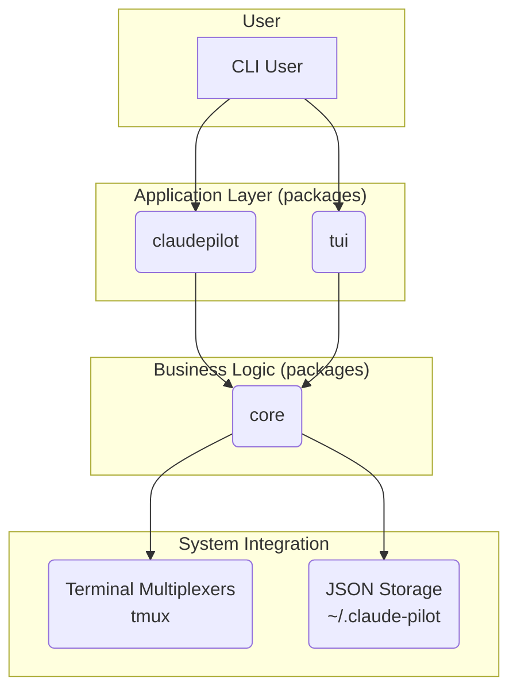

# Claude Pilot 🚀

**Claude Pilot is a command-line interface (CLI) tool designed to manage multiple Claude Code CLI instances simultaneously, enabling developers to create, manage, and interact with multiple AI-powered coding sessions through an intuitive terminal interface.**

[](https://golang.org/dl/)
[](https://opensource.org/licenses/MIT)
[](https://github.com/HexSleeves/claude-pilot)
[](https://github.com/HexSleeves/claude-pilot/pulls)

---

## Table of Contents

- [Claude Pilot 🚀](#claude-pilot-)
  - [Table of Contents](#table-of-contents)
  - [About The Project](#about-the-project)
  - [Key Features](#key-features)
  - [Demo](#demo)
  - [Getting Started](#getting-started)
    - [Prerequisites](#prerequisites)
    - [Installation](#installation)
  - [Usage](#usage)
    - [Core Commands](#core-commands)
  - [Architecture](#architecture)
  - [Roadmap](#roadmap)
  - [Contributing](#contributing)
  - [License](#license)
  - [Contributors](#contributors)
  - [Cursor Rules](#cursor-rules)

---

## About The Project

Developers often work on multiple projects or tasks simultaneously, but Claude Code CLI instances are typically single-session and don't persist across terminal sessions. This makes it difficult to manage multiple conversations for different contexts and requires manual session management when switching between tasks.

**Claude Pilot** solves this by providing a session management system that allows developers to:

- Create and manage multiple named Claude Code sessions.
- Persist sessions across terminal restarts.
- Switch between different coding contexts seamlessly.
- Maintain session history and metadata.
- Organize work by project or task.

It's built with Go and leverages terminal multiplexers like `tmux` to provide a robust and familiar experience for power users. Support for `zellij` is planned for future releases.

---

## Key Features

- **Multi-Session Management**: Create, list, and terminate multiple `claude code` CLI instances.
- **Session Persistence**: Session metadata is stored on your local machine and persists across application restarts.
- **Terminal Multiplexer Support**: Uses `tmux` for session management (zellij support planned).
- **Interactive Mode**: Attach to any session to interact directly with the Claude CLI.
- **Detailed Session Information**: The `list` command shows session ID, name, status, creation time, and more.
- **Named Sessions**: Give your sessions meaningful names to easily organize your work (e.g., `react-app`, `api-bug-fix`).
- **Intuitive CLI**: A clean, `tmux`-inspired command structure that is easy to learn and use.
- **Colored UI**: A beautiful, colored terminal output with tabular session lists for clarity.

---

## Demo

Watch this short demo to see Claude Pilot in action:

<p align="center">
  <video controls poster="assets/claude-pilot-demo.gif">
    <source src="assets/claude-pilot-demo.mp4" type="video/mp4">
    Your browser does not support the video tag.
  </video>
</p>

---

## Getting Started

### Prerequisites

You must have the following tools installed and available in your system's PATH:

1. **Claude CLI**: The `claude` command-line tool.
2. **Terminal Multiplexer**:
    - `tmux` (required)

### Installation

You can install Claude Pilot using `go install`:

```bash
# Replace with the actual repository path when available
go install github.com/HexSleeves/claude-pilot@latest
```

Alternatively, you can build it from the source:

```bash
# Replace with the actual repository URL
git clone https://github.com/HexSleeves/claude-pilot.git
cd claude-pilot
go build -o claude-pilot
sudo mv claude-pilot /usr/local/bin/
```

---

## Usage

Claude Pilot provides a simple and powerful set of commands to manage your sessions.

### Core Commands

**`create [session-name]`**
Creates a new Claude session. If no name is provided, a random one will be generated.

```bash
claude-pilot create my-go-project
```

**`list`**
Lists all active and inactive sessions in a clean, tabular format.

```bash
claude-pilot list
```

**`attach <session-id|session-name>`**
Attaches to an existing session, allowing you to interact with Claude.

```bash
claude-pilot attach my-go-project
```

Inside the session, you can use standard multiplexer commands to detach (e.g., `Ctrl+B, D` for tmux).

**`kill <session-id|session-name>`**
Terminates a specific session.

```bash
claude-pilot kill my-go-project
```

**`kill-all`**
Terminates all running sessions.

```bash
claude-pilot kill-all
```

---

## Architecture

Claude Pilot is designed with a modular, monorepo architecture to separate concerns and promote code reuse. The project is divided into three main packages: `claudepilot`, `core`, and `tui`.



- **`packages/core`**: The heart of the application. This package contains all the core business logic, including:
  - **Service (`service/`)**: Manages session lifecycle (create, read, update, delete).
  - **Multiplexer (`multiplexer/`)**: An interface to communicate with terminal multiplexers like `tmux` (zellij support planned).
  - **Storage (`storage/`)**: Handles saving and retrieving session metadata from the filesystem as JSON.
  - **Configuration (`config/`)**: Manages application configuration.

- **`packages/claudepilot`**: The primary command-line interface.
  - Built with **Cobra**, it provides the main entry point for users to interact with the application (e.g., `claude-pilot create`, `list`, `attach`, `kill`).
  - It consumes the `core` package to perform its operations.
  - Contains the UI logic for the standard CLI output (`internal/ui/`).

- **`packages/tui`**: A rich, interactive Terminal User Interface (TUI).
  - Built with **Bubble Tea**, it offers a more visual and interactive way to manage sessions.
  - Like the `claudepilot` CLI, it is also a consumer of the `core` package.

This decoupled architecture allows for flexible development and makes it easier to maintain and extend the application's capabilities. For example, the `core` logic can be shared across different frontends (CLI, TUI, and potentially a future web UI) without duplication.

---

## Roadmap

We have an exciting roadmap ahead! Here are some of the features we're planning to implement:

- **Phase 1: Core MVP (Complete)**
  - [x] Basic CLI structure with Cobra
  - [x] Session data model and storage
  - [x] Tmux integration layer
  - [x] `create`, `list`, `attach`, `kill` commands
  - [x] Enhanced UI with colors and tables
  - [x] Session metadata persistence

- **Phase 2: Advanced Features**
  - [x] `kill-all` command implementation
  - [ ] Zellij backend support
  - [ ] `attach` enhancement (add panels / tabs to existing sessions)
  - [ ] Session templates and presets
  - [ ] Session search and filtering
  - [ ] Export/import session configurations

- **Phase 3: Integrations & Release**
  - [ ] Cross-platform compatibility testing (Windows, Linux, macOS)
  - [ ] Official package distribution (Homebrew, etc.)
  - [ ] Detailed documentation and tutorials

See the [open issues](https://github.com/HexSleeves/claude-pilot/issues) for a full list of proposed features (and known issues).

---

## Contributing

Contributions are what make the open-source community such an amazing place to learn, inspire, and create. Any contributions you make are **greatly appreciated**.

If you have a suggestion that would make this better, please fork the repo and create a pull request. You can also simply open an issue with the tag "enhancement".

1. Fork the Project
2. Create your Feature Branch (`git checkout -b feature/AmazingFeature`)
3. Commit your Changes (`git commit -m '''Add some AmazingFeature'''`)
4. Push to the Branch (`git push origin feature/AmazingFeature`)
5. Open a Pull Request

---

## License

Distributed under the MIT License. See `LICENSE` file for more information.

---

## Contributors

A huge thanks to all the people who have contributed to this project.

<!-- Add contributors here -->
<a href="https://github.com/HexSleeves/claude-pilot/graphs/contributors">
  
</a>

## Cursor Rules

Claude Pilot includes a set of project rules under `.cursor/rules` that guide AI agents:

| Rule File | Purpose |
|-----------|---------|
| `ReviewGateV2.mdc` | Enforces Review Gate interactive feedback flow |
| `cursor_rules.mdc` | General guidelines for writing effective rules |
| `self_improve.mdc` | Continuous improvement heuristics |
| `debug.mdc` | Systematic debugging workflow |
| `decompose.mdc` | Breaks PRDs into granular tasks |
| `prd.mdc` | Generates Product Requirement Documents from ideas |
| `task.mdc` | Two-phase task planning & execution protocol |
| `golang_cli_tui.mdc` | Best practices for Go CLI/TUI apps with Cobra & Bubbletea |

Refer to these rules when interacting with Cursor’s AI agents to get consistent, high-quality assistance.
