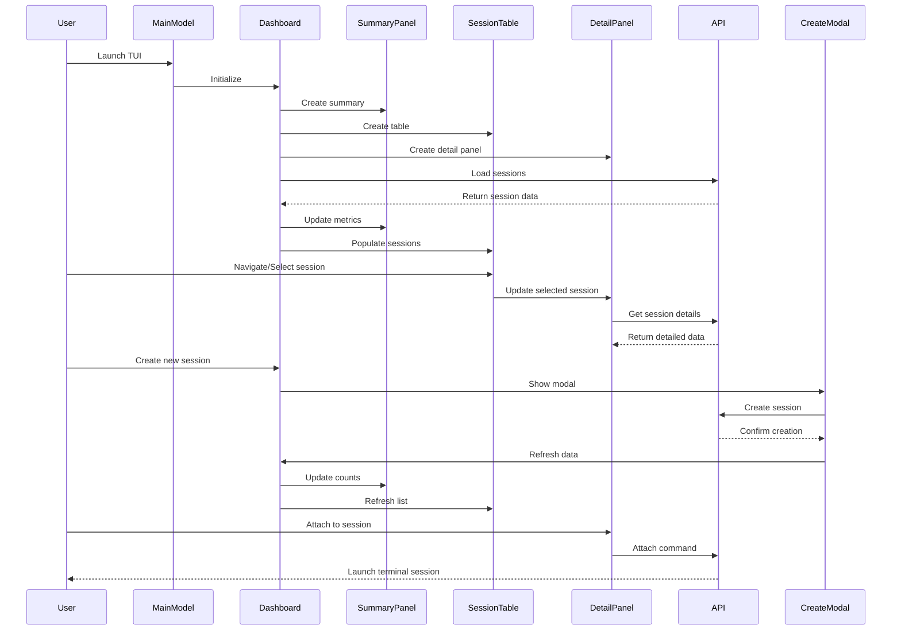

I have created the following plan after thorough exploration and analysis of the codebase. Follow the below plan verbatim. Trust the files and references. Do not re-verify what's written in the plan. Explore only when absolutely necessary. First implement all the proposed file changes and then I'll review all the changes together at the end. Make sure you fix all the linting, compilation or validation issues after successful implementation of the plan.

### Observations

Based on my exploration of the codebase, I found a well-structured Go project with three main packages: `tui` (current Bubble Tea implementation), `core` (business logic and API), and `claudepilot` (CLI with rich styling). The current TUI is functional but basic, using simple view switching between session list, detail, and creation forms. The CLI package has sophisticated styling and table components that can be leveraged. The core package provides a clean API client interface. The referenced blog post emphasizes component composition, responsive design, and proper state management for advanced Bubble Tea applications.

### Approach

I'll rework the TUI into a beautiful, responsive dashboard by: 1) Creating a unified style system shared across packages, 2) Implementing a multi-panel dashboard layout with summary cards, responsive session table, and detail panels, 3) Building reusable Bubble Tea components following best practices, 4) Adding proper responsive behavior and enhanced visual hierarchy, 5) Integrating the existing table component from CLI package, and 6) Implementing smooth navigation and better user experience patterns.

### Reasoning

I explored the project structure and examined all key files including the current TUI implementation, core API client, existing CLI styling components, configuration system, and the existing table implementation. I also researched the referenced blog post about Bubble Tea best practices to understand advanced patterns for building production-ready TUI applications.

## Mermaid Diagram

## Proposed File Changes

### packages/shared(NEW)

Create a new shared package directory to house common styling and utility components that will be used by both TUI and CLI packages.

### packages/shared/go.mod(NEW)

Create go.mod file for the shared package with module name `claude-pilot/shared` and Go version 1.24.5. Add dependencies for `github.com/charmbracelet/lipgloss` and `github.com/jedib0t/go-pretty/v6` to support styling and table components.

### packages/shared/styles(NEW)

Create styles directory within shared package to contain unified styling system.

### packages/shared/styles/theme.go(NEW)

Create unified theme system that consolidates the color palettes and base styles from both `/Users/jacob.lecoq.ext/Projects/go_projects/claude-pilot/packages/tui/internal/styles/styles.go` and `/Users/jacob.lecoq.ext/Projects/go_projects/claude-pilot/packages/claudepilot/internal/styles/lipgloss.go`. Define color constants, base styles for typography, status indicators, interactive elements, and layout components. Include responsive breakpoint constants and helper functions for adaptive styling.

### packages/shared/components(NEW)

Create components directory for reusable UI components that can be shared between TUI and CLI.

### packages/shared/components/table.go(NEW)

Create a unified table component that adapts the existing table implementation from `/Users/jacob.lecoq.ext/Projects/go_projects/claude-pilot/packages/claudepilot/internal/ui/table.go`. Make it more flexible and reusable for both CLI and TUI contexts. Include responsive column sizing, customizable styling, and support for different data types. Add methods for rendering both as static strings (CLI) and as interactive Bubble Tea components (TUI).

### packages/shared/components/cards.go(NEW)

Create card components for dashboard-style layouts. Include SummaryCard for displaying metrics (total sessions, active count, etc.), StatusCard for showing system status, and InfoCard for general information display. Each card should support responsive sizing, consistent styling using the shared theme, and optional icons/indicators.

### packages/shared/layout(NEW)

Create layout directory for responsive layout utilities and components.

### packages/shared/layout/responsive.go(NEW)

Create responsive layout utilities including FlexRow, FlexColumn, Grid, and Panel components. These should handle automatic sizing based on terminal dimensions, support minimum/maximum widths, and provide consistent spacing and alignment. Include breakpoint detection and adaptive layout switching for different terminal sizes.

### packages/tui/go.mod(MODIFY)

Update the TUI go.mod file to include the new shared package dependency. Add `claude-pilot/shared v0.0.0-00010101000000-000000000000` to the require section and add a replace directive `replace claude-pilot/shared => ../shared` to reference the local shared package.

### packages/tui/internal/models/dashboard.go(NEW)

Create a new dashboard model that serves as the main view, replacing the simple view switching in the current implementation. This model will manage a multi-panel layout with summary cards at the top, session list in the center, and detail panel on the right. Implement proper Bubble Tea model interface with Init, Update, and View methods. Handle responsive layout switching based on terminal size and manage communication between child components.

### packages/tui/internal/models/summary_panel.go(NEW)

Create a summary panel model that displays key metrics and system status at the top of the dashboard. Show total sessions, active/inactive counts, current backend, and system health indicators. Use the shared card components from `/Users/jacob.lecoq.ext/Projects/go_projects/claude-pilot/packages/shared/components/cards.go`. Implement auto-refresh capabilities and smooth transitions when data updates.

### packages/tui/internal/models/session_table.go(NEW)

Create an enhanced session table model that replaces the simple list in `/Users/jacob.lecoq.ext/Projects/go_projects/claude-pilot/packages/tui/internal/models/session_list.go`. Use the shared table component from `/Users/jacob.lecoq.ext/Projects/go_projects/claude-pilot/packages/shared/components/table.go` but make it interactive for TUI use. Support keyboard navigation, sorting, filtering, and selection. Include visual indicators for session status, responsive column sizing, and smooth scrolling for large session lists.

### packages/tui/internal/models/detail_panel.go(NEW)

Create an enhanced detail panel model that improves upon `/Users/jacob.lecoq.ext/Projects/go_projects/claude-pilot/packages/tui/internal/models/session_detail.go`. Display comprehensive session information in a well-organized, scrollable panel. Include session metadata, recent message history with syntax highlighting, action buttons, and real-time status updates. Use shared styling and layout components for consistent appearance.

### packages/tui/internal/models/create_modal.go(NEW)

Create a modal-style session creation component that replaces the full-screen form in `/Users/jacob.lecoq.ext/Projects/go_projects/claude-pilot/packages/tui/internal/models/create_session.go`. Implement as an overlay that appears over the dashboard, with improved form validation, auto-completion for project paths, and better visual feedback. Include proper focus management and keyboard navigation.

### packages/tui/internal/ui/main.go(MODIFY)

Completely rework the main TUI model to use the new dashboard-based architecture. Replace the simple view switching with a sophisticated layout manager that coordinates the dashboard, summary panel, session table, and detail panel. Implement proper message routing between components, responsive layout management, and enhanced keyboard shortcuts. Update imports to use the shared styling system and remove dependencies on the old individual model files.

### packages/tui/internal/styles(DELETE)

Remove the old TUI-specific styles directory since styling is now handled by the shared package.

### packages/tui/internal/models/session_list.go(DELETE)

Remove the old session list model as it's replaced by the new session table component.

### packages/tui/internal/models/session_detail.go(DELETE)

Remove the old session detail model as it's replaced by the new detail panel component.

### packages/tui/internal/models/create_session.go(DELETE)

Remove the old create session model as it's replaced by the new modal-style component.

### packages/tui/main.go(MODIFY)

Update the main TUI entry point to use the new dashboard model and shared styling. Ensure proper initialization of the enhanced TUI with improved error handling and better program options (such as mouse support configuration based on terminal capabilities).

### packages/claudepilot/go.mod(MODIFY)

Update the claudepilot go.mod to include the shared package dependency. Add `claude-pilot/shared v0.0.0-00010101000000-000000000000` to the require section and add replace directive `replace claude-pilot/shared => ../shared`.

### packages/claudepilot/internal/styles/lipgloss.go(MODIFY)

Update the CLI styles to import and use the shared theme system from `/Users/jacob.lecoq.ext/Projects/go_projects/claude-pilot/packages/shared/styles/theme.go`. Remove duplicate style definitions and instead re-export or wrap the shared styles. Maintain backward compatibility for existing CLI code while ensuring consistency with the TUI.

### packages/claudepilot/internal/ui/table.go(MODIFY)

Update the CLI table implementation to use the shared table component from `/Users/jacob.lecoq.ext/Projects/go_projects/claude-pilot/packages/shared/components/table.go`. Refactor to use the shared component's CLI rendering mode while maintaining all existing functionality. Update imports to use shared styling system.

### packages/claudepilot/internal/ui/colors.go(MODIFY)

Update the CLI colors implementation to use the shared theme system. Import color definitions from `/Users/jacob.lecoq.ext/Projects/go_projects/claude-pilot/packages/shared/styles/theme.go` and update all color references to use the unified palette. Maintain the fatih/color-based functions for CLI compatibility while ensuring color consistency with TUI.
